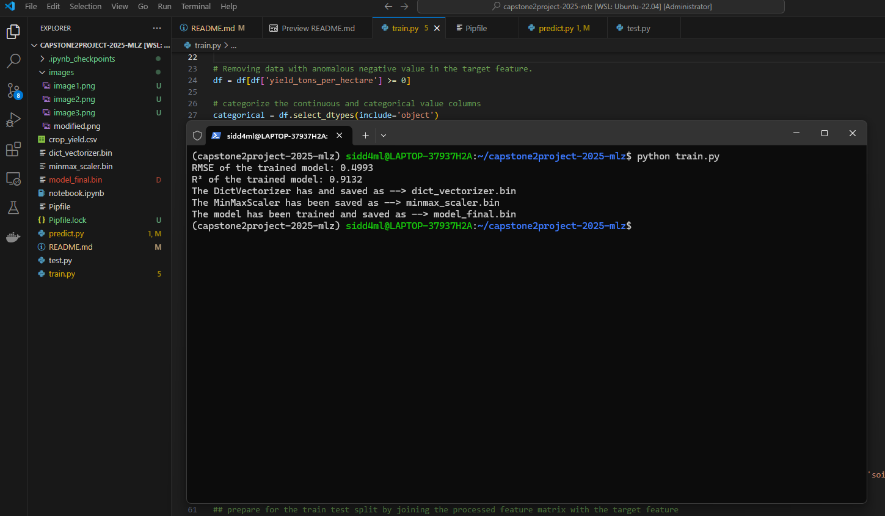

# Agriculture Crop Yield Predictor #

## Problem Description ##

 **Context**

 Agriculture is one of the key pillars of the global economy, providing food and raw materials for countless industries. Accurate predictions of crop yields are crucial for ensuring food security, optimizing resource use, and supporting sustainable agricultural practices. Traditionally, predicting crop yields relied on historical data and farmer expertise, which, while valuable, often lacked the precision required for modern agricultural challenges.

 In recent years, machine learning techniques have emerged as powerful tools for enhancing yield predictions by analyzing various factors that influence crop productivity, such as weather, soil conditions, and agricultural practices. This project aims to leverage these advancements to build a robust predictive model that can estimate crop yields with high accuracy based on a range of input features.

 **The Dataset**

 The dataset is sourced from Kaggle's Agriculture Crop Yield Prediction dataset and can be found at <https://www.kaggle.com/datasets/samuelotiattakorah/agriculture-crop-yield/data>. A copy of the dataset is also enclosed in this project repository. It contains data for 1,000,000 records, each with various features related to agricultural practices and environmental conditions. The dataset is well-suited for regression tasks, with the goal of predicting the crop yield (in tons per hectare) based on factors such as weather conditions, soil type, irrigation practices, and crop variety.

 Key Attributes of the Dataset:

 - Region: The geographical region where the crop is grown (North, East, South, West).
 - Soil Type: The type of soil in which the crop is planted (Clay, Sandy, Loam, Silt, Peaty, Chalky).
 - Crop: The type of crop grown (Wheat, Rice, Maize, Barley, Soybean, Cotton).
 - Rainfall (mm): The amount of rainfall received during the crop growth period, measured in millimeters.
 - Temperature (°C): The average temperature during the crop growth period, measured in degrees Celsius.
 - Fertilizer Used: Whether fertilizer was applied during the crop growth period (True/False).
 - Irrigation Used: Whether irrigation was used during the crop growth period (True/False).
 - Weather Condition: The predominant weather condition during the crop’s growing season (Sunny, Rainy, Cloudy).
 - Days to Harvest: The number of days taken for the crop to be harvested after planting.
 - Yield (tons/hectare): The total crop yield produced, measured in tons per hectare.
 
 The data has been preprocessed to remove inconsistencies, making it ready for use in predictive modeling.

 **The Problem**

 Accurately predicting crop yield is essential for various stakeholders in the agricultural sector, including farmers, policymakers, and supply chain managers. However, this task is fraught with challenges:

 - **Environmental Variability**: Weather conditions, rainfall measure, soil types, and regional differences impact crop growth, making yield prediction highly variable.
 - **Data Inconsistencies**: Different farming practices, local environmental factors, and varying data collection standards may lead to inconsistencies in the dataset, making   predictions more complex.
 - **Resource Optimization**: In many regions, optimizing the use of resources such as irrigation and fertilizers is crucial for sustainability. Predicting the yield can help guide decisions about these resources.

 Addressing these challenges through a machine learning approach can provide more accurate and timely predictions, which in turn will help stakeholders make informed decisions about crop management, resource allocation, and planning. 

 **Solution: Project Objective**

 The objective of this project is to develop a regression model that can predict the yield of various crops based on the provided features. The model will leverage machine learning techniques to capture the complex relationships between the different factors affecting crop yield, such as measure of rainfall, agricultural practices and soil type

 The proposed model aims to achieve:

 - **High Accuracy**:  The model shall be trained post feature selection to improve accuracy and applied feature scaling, if required for handling the complexities of the dataset.
 - **Generalizability**: The model will be trained to generalize across different input features, ensuring its adaptability to various real-world agricultural settings.
 - **Actionable Insights**: The model will provide interpretability through feature importance analysis, helping users understand the relative impact of different factors on crop yield.

 Additionally, the successful development of this crop yield prediction model can have a broad range of real-world applications:

 - **Precision Agriculture:** Helping farmers make data-driven decisions on irrigation, fertilization, and crop management to optimize yield and reduce waste.
 - **Supply Chain Management:** Supporting agricultural businesses and retailers by providing better forecasts of crop availability and helping with inventory and distribution planning.
 - **Government Planning:** Assisting policymakers in assessing agricultural productivity and formulating policies for food security and resource management.
 - **Sustainable Agriculture:** Promoting environmentally sustainable farming practices by predicting and minimizing resource usage based on crop needs and conditions.

## Exploratory Data Analysis ##

 **Cleaning and preparation of the dataset have been done as prerequisites to the EDA here involving:**

  - Loading the dataset and checking its basic information.
  - Sanitizing column names.
  - Checking null and duplicates in the dataset
  - Removing anomalous data from the target feature.
  - Assigning appropriate datatypes to featrures/columns

 For the Exploratory Data Analysis , starting with drawing inference from basic statistical data, I move on for an extensive EDA involving:

  - Analysis of the Target feature (Crop Yield in tons per hectare of land)
  - Checking count distribution and unique values of the categorical features
  - Analysis of the target variable with respect to the categorical attributes of the dataset
  - Analysis of the dataset for detecting outliers in the continuous features
  - Checking the correlation among the all the continuous feature including the target feature with a Heatmap analysis
  - Analysing the inpact of the most significant independent feature in the feature matrix on the target variable for different soil types.
  
 _These exercises could be found in my_ **_notebook.ipynb_**
 

## Model Training ##

 As a pre-requisite of the model training, I had to:

  - Encode the categorical features with DictVectorizer
  - Apply Min Max Scaling to the continuous features for mitigating vast differences in scale of values among them detected at EDA phase.
  - Feature Selection through Lasso regularization and Recursive Feature Elimination (RFE).
  - Splitting of the dataset into full-train, test, train and validation with target features split accordingly

 Then the model training ensued for training multiple models and tuning their parameters which include the following:

  - Trained the model with Linear Regression, DecisionTreeRegressor and RandomForrestRegressor.
  - Evaluated best parameters for the DecisionTreeRegressor and RandomForrestRegressor models.
  - With the best evaluated paramenters for each of the models, compared the R² and RMSE metrics and found the best model.
  - For the best evaluated model, did training with the full train dataset and validated with the test dataset.

 _These exercises could be found in my_ **_notebook.ipynb_**

## Exporting the Training Notebook to Script ##

  All data structure and data transformation including their preparation & cleaning, feature scaling, feature selection and model training of the best evaluated model have been exported from the notebook in the form of a script namely train.py Running this script will outcome in the generation of the model_final.bin file which holds the final trained model.

## Dependency and environment management ##

 _All project dependencies are listed in the_ **_Pipfile_**

 1\. Go the your wsl environment from you powershell terminal with administrator privilege. You should land in your WSL home directory by default.

     wsl

 2\. If you do not have pipenv installed already, you can install it by with the command

     pip install pipenv

 3\. From your home directory at WSL, clone my GitHub project repository with the link I submitted

     git clone https://github.com/SapientSapiens/capstone2project-2025-mlz.git

 4\. Go inside that cloned directory

     cd capstone2project-2025-mlz

 5\. Install all dependencies/packages mentioned in the **Pipfile** within the new virtual environment being created

     pipenv install

   

 6\. Activate the new virtual environment created:

     pipenv shell

   

## Reproducibility ##

 1\. In your virtual environment, form within the project directory, run the jupyter notebook. From the Jupyter notebook GUI, you can open my **notebook.ipynb** and review it.

    jupyter notebook

   

 2\. From within the virtual environment from inside the project directory, kindly run the **train.py** script to train the best evaluated model on the dataset from **crop_yield.csv** and save the model
   
    python train.py

   

## Model Deployment ##

 1\. Please run the **gunicorn** WSGI http server to make the flask web-service (**predict.py)** serving the model, active for consumption/use by running this command inside the virtual environment from inside the project folder

    gunicorn --bind 0.0.0.0:9696 predict:app

   

 2\. When the gunicorn server had started successfully, open another powershell window, go to WSL and cd to project folder. Then activate the virtual environment. Now, you can run the **test.py** from within the virtual environment from inside the project directory to see if the deployed model is served through the web service and what the model predicts.

    python test.py

## Containerization ##

 1\. Install Docker Deskop on you Windows 11 (currently I have Docker Desktop version 4.35.0). If you have other set up, you may install docker accordingly (Mac/Linux/Windows 10)

 2\. In the settings of Docker Desktop, in the 'General' tab/menu please ensure you have "Use the WSL 2 based engine (Windows Home can only run the WSL 2 backend)" checked/ticked.

 3\. Again, in the settings, "WSL integration" sub menu in the "Resources" menu/tab, please ensure "Enable integration with my default WSL distro" is checked/ticked. Further ensure that the "Enable integration with additional distros:" slider button is turned on.

 4\. Start the Docker Engine in the Docker Desktop, if not already started.

 5\. Now open one WSL tab and go the project directory. From there, issue the command to build the docker image.. The image would be built as mentioned in the submitted **Dockerfile**.

    docker build -t capstone2-mlz .

 6\. After the image is built and the application successfully containerized, we can list the image from the WSL by following command

    docker images

 7\.  Now run the containerized application.

    docker run -it --rm -p 9696:9696 capstone2-mlz

 8\. Now activate virtual environment in another WSL tab from inside the project directory and run the **test.py** from that virtual environment from inside the project directory to get the **predict service** from the containerized application

    python test.py

## Cloud Deployment ##

 1\. Navigate to project directory and issue the following command to install awsebcli (Amazon Web Service Elastic Beanstalk Command Line Interface)

    pipenv install aswebcli --dev

 2\. Activate your virtual environment from the project directory and issue following command to create your AWS EB application from your virtual environment form inside the project directory (my application name is capstone2-mlz-cloud and region is eu-north-1)

    eb init -p docker -r eu-north-1 capstone2-mlz-cloud

 3\. After you application is successfully created, from the virtual environment from within the project directory, issue following command to launch the environment. On successful launching of the cloud environment, We shall also get the URL/Domain name here starting with "Application available at <...> "

    eb create capstone2-mlz-cloud --enable-spot

 4\. I have used this URL in a test script namely cloud_test.py to test the containerized application hosted at the AWS EB. We run it to check if our dockerized application in the cloud is working is properly and the model is serving the prediction.

    python cloud_test.py

 